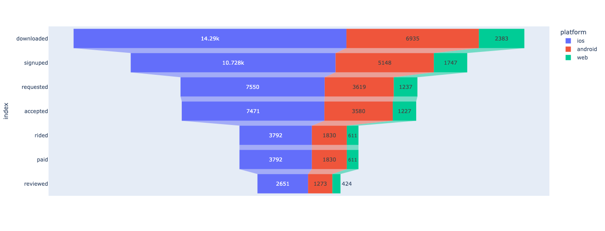
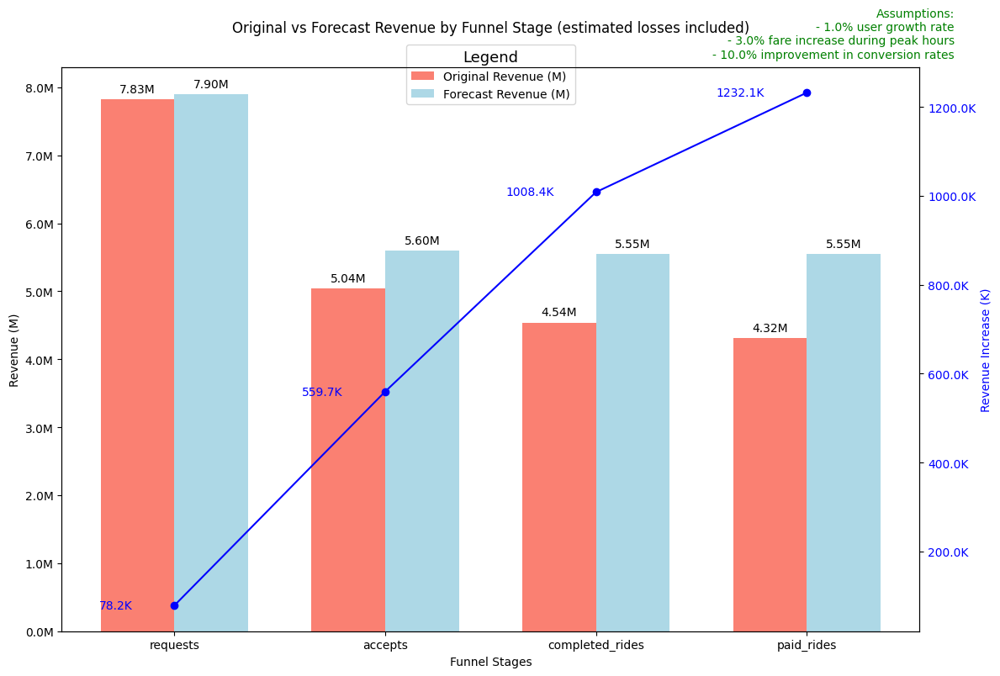

# Metrocar Funnel Analysis

**Optimizing the Customer Journey for Metrocar Ride-Sharing App**  
**Created by Svitlana Kovalivska, PhD**

## 📌 Introduction

This project analyzes the user journey within the Metrocar ride-sharing platform to identify drop-off points, improve retention, and deliver strategic recommendations that optimize user engagement and revenue. The analysis uses real-world data and funnel modeling techniques to offer insights across multiple dimensions including platforms, user age groups, and time-based behavior.


## 📚 Table of Contents

- [Introduction](#introduction)
- [Features](#features)
- [Data Sources](#data-sources)
- [Installation](#installation)
- [Usage](#usage)
- [Funnel Metrics](#funnel-metrics)
- [Analysis Highlights](#analysis-highlights)
- [Recommendations](#recommendations)
- [Dependencies](#dependencies)
- [Troubleshooting](#troubleshooting)
- [Contributors](#contributors)
- [License](#license)

## ✨ Features

- Funnel stage tracking: App Download → Signup → Ride Request → Ride Accepted → Ride Completed → Payment → Review
- Conversion rate analysis (percent of previous and percent of top)
- Platform-specific performance comparison (iOS, Android, Web)
- Segmentation by age group
- Time-based behavior analysis for ride requests
- Strategic business recommendations including surge pricing and UX improvements

## 🗂️ Data Sources

The analysis was based on five datasets:

- `App_Downloads`
- `Signups`
- `Ride_Requests`
- `Transactions`
- `Reviews`

These were cleaned, merged, and transformed using PostgreSQL and Python.

## 🛠 Installation

1. Clone this repository or download the `.ipynb` notebook.
2. Ensure Python 3.8+ is installed.
3. Install dependencies:
   ```bash
   pip install -r requirements.txt
   ```
4. Ensure access to the PostgreSQL database and update the credentials in the script:
   ```python
   metrocar_url = "postgresql://<username>:<password>@<host>/<database>"
   ```

## 🚀 Usage

Open the `Metrocar.ipynb` file and run the notebook in a Jupyter environment. The notebook connects to the remote PostgreSQL database, loads and merges the datasets, then performs analysis across various funnel stages and demographic segments.

## 📊 Funnel Metrics

Key Stats:

- **Downloads:** 23,608  
- **Signups:** 74.68% of downloads  
- **Ride Requests:** 70.4% of signups  
- **Rides Completed:** 50.7% of requests  
- **Paid Rides:** 100% of completed rides  
- **Reviews:** 69.8% of riders  

## 🔍 Analysis Highlights

- 🚫 **Biggest Drop-Off:** Between *Ride Request* and *Ride Completed*
- 📱 **Top Performing Platform:** iOS, though Android follows closely
- 👥 **Best Engaged Group:** Age 25–34 with highest funnel retention
- 🕒 **Peak Ride Request Hours:** 8–9 AM, 4–5 PM, 6–7 PM
- 💸 **Price Stability:** Average ride cost remains ~$20 with low variance across time and age
- **FORECAST**


## 💡 Recommendations

- **Boost Request-to-Ride Conversion:** Improve driver response time and system matching
- **Platform Enhancements:** 
  - Web: Simplify signup, improve UX, and optimize performance
  - Mobile: Incentivize review submissions and ride completions
- **Age-Specific Strategies:**
  - Focus marketing on 25–34
  - Simplify flows for 45+ age users
- **Introduce Surge Pricing:** During morning/evening peaks with proper user communication
- **Improve Onboarding:** Enhance activation within the first 48 hours post-signup

## 📦 Dependencies

- `pandas`
- `numpy`
- `matplotlib`
- `seaborn`
- `sqlalchemy`
- `psycopg2` (or `asyncpg`, if using asynchronous connection)

## 🛠 Troubleshooting

- **Database Connection Error:** Double-check credentials and ensure the database is accessible externally.
- **Missing Data:** Verify that all required tables (`App_Downloads`, `Signups`, etc.) are available in the connected database.
- **Plotting Issues:** Ensure all libraries are installed and use `%matplotlib inline` in Jupyter.

## 👩‍💻 Contributors

- **Dr. Svitlana Kovalivska** — Project Creator and Data Analyst  
  [GitHub Profile](https://github.com/Kovalivska)

## 📝 License

This project is intended for educational purposes as part of the Master's program at Masterschool, Germany.  
© 2024 Svitlana Kovalivska, PhD. All rights reserved.